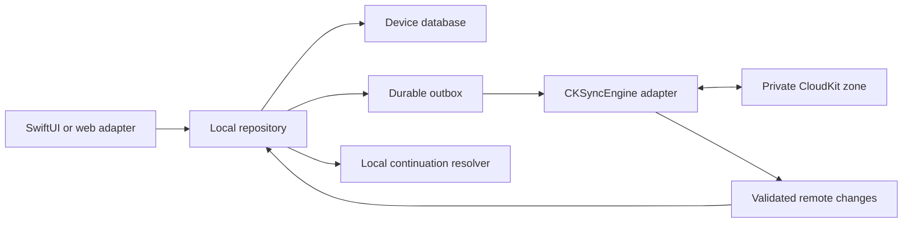
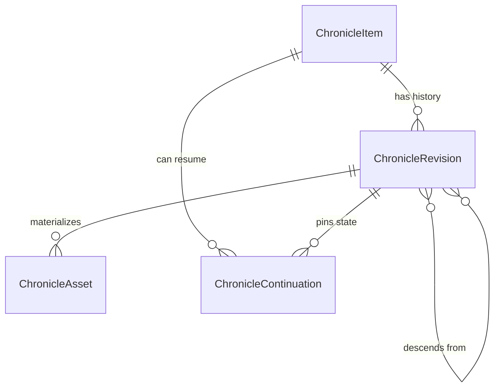

# Architecture Spine — Chronicle Apple CloudKit Sync and Handoff

## Design Paradigm

Local-first replicated record log with immutable revisions. Each Apple device commits to its own durable database first. A durable outbox replicates immutable revisions through the user's private CloudKit database. Mutable item heads select the current revision; they never erase the revision graph.



## Invariants & Rules

### AD-1 — Local commit is authoritative for interaction [ADOPTED]

- **Binds:** all user-owned record mutations
- **Prevents:** network availability from becoming a prerequisite for reading or writing
- **Rule:** A mutation reports success only after the new item, revision, and outbox entry commit atomically to the device database; CloudKit runs asynchronously.

### AD-2 — CloudKit is a private replica and archive [ADOPTED]

- **Binds:** Apple-device sync and recovery
- **Prevents:** public exposure, third-party storage, and per-device data silos
- **Rule:** Use only `CKContainer(identifier: "iCloud.com.binion.chronicle").privateCloudDatabase` and custom zone `ChronicleData-v1`; never use public or shared databases for Chronicle records.

### AD-3 — Stable items expose every immutable branch head

- **Binds:** ChronicleItem, ChronicleRevision, all syncable kinds
- **Prevents:** overwrites from destroying older data
- **Rule:** Every logical object has one stable item UUID. Every change creates a new immutable revision. The item stores the complete set of maximal revision tips; it never hides a losing branch or deletes prior revisions.

### AD-4 — Offline conflicts preserve both histories

- **Binds:** concurrent updates from Mac, iPhone, and iPad
- **Prevents:** last-writer-wins data loss
- **Rule:** A head update uses server-change-tag preconditions. On conflict, union local and server tips, remove every tip that is an ancestor of another, and sort the remaining UUIDs. Lossless kind-specific merges create one revision with every remaining tip as a parent; unresolved scalar conflicts keep the sorted tip set visible until a user-authored resolution revision descends from all tips.

### AD-5 — Deletion is a revision, not erasure

- **Binds:** delete, restore, and history retrieval
- **Prevents:** resurrection by an offline device and accidental permanent loss
- **Rule:** Delete creates an empty tombstone revision. If a tombstone is concurrent with a live tip, the item stays hidden but both tips remain retrievable; only an explicit restore or conflict-resolution revision descending from every tip can make it live again. Permanent purge is not part of automatic sync.

### AD-6 — Content classes have one declared sync scope

- **Binds:** adapters for every persisted Chronicle type
- **Prevents:** credentials, caches, licensed corpora, or transient media leaking into CloudKit
- **Rule:** Sync user-owned records and required user assets only. Bundled or licensed corpora, caches, credentials, voice configuration, transient audio, and device UI state remain local-only.

### AD-7 — Private fields use CloudKit encryption

- **Binds:** user text, filenames, hashes, device labels, routes, and payloads
- **Prevents:** readable private content fields in the CloudKit schema
- **Rule:** Store private scalar and data fields through `CKRecord.encryptedValues`; use `CKAsset` for files, which CloudKit encrypts by default. Only query metadata needed for sync stays unencrypted.

### AD-8 — One sync engine owns CloudKit mutation

- **Binds:** native apps, web bridge, background tasks
- **Prevents:** competing writers and incompatible retry behavior inside one process
- **Rule:** UI and web code depend on the local repository only. A single native sync coordinator owns CKSyncEngine, CloudKit conversion, retry, change tokens, and account-state handling.

### AD-9 — Remote changes pass through local validation

- **Binds:** incoming records and schema migrations
- **Prevents:** corrupt or future-schema records from mutating local state
- **Rule:** Decode, authenticate references, verify hashes, migrate supported versions, and commit an inbox batch atomically before exposing it. Quarantine unsupported or invalid records without deleting their cloud copy.

### AD-10 — Handoff follows replication

- **Binds:** cross-device continuation
- **Prevents:** a continuation pointer from opening missing or stale content
- **Rule:** A ChronicleContinuation references an item and revision. The revision declares every required asset ID. The target verifies the revision and complete asset manifest are committed locally, then changes ephemeral navigation state after user acceptance.

### AD-11 — Account identity partitions every local replica

- **Binds:** iCloud sign-in, sign-out, account switch, reinstall
- **Prevents:** one iCloud user's local records from uploading into another user's private database
- **Rule:** Partition SQLite, outbox, inbox, sync-engine state, and caches by the current CloudKit user record identity. Stop sync on account change; never rebind pending data to a new account without explicit import confirmation.

### AD-12 — Cross-platform payload encoding is normative

- **Binds:** Swift and TypeScript record adapters
- **Prevents:** equal logical records from hashing, merging, or decoding differently
- **Rule:** Encode payload envelopes with RFC 8785 JSON Canonicalization Scheme, UTF-8, explicit kind and schema ID, and UTC date rules. Each enabled kind requires a checked-in JSON Schema plus shared golden fixtures that pass in every Apple target and the web adapter.

### AD-13 — Dependency saves are ordered and repairable

- **Binds:** outbox scheduling and partial CloudKit failures
- **Prevents:** an item head or continuation from referencing data that never reached CloudKit
- **Rule:** Configure CKSyncEngine send changes with `atomicByZone: true` for each dependency batch. Upload revisions and required assets to confirmation before enqueueing dependent item heads, then continuations. Never coalesce unsent revisions. Incoming dangling references stay quarantined and are retried; they never advance local state.

### AD-14 — Legacy migration is deterministic and idempotent

- **Binds:** Zustand/localStorage and existing database migration
- **Prevents:** duplicate cloud items after reinstall or migration on multiple devices
- **Rule:** Derive the first item UUID from the fixed Chronicle namespace plus `(kind, legacyID)` using the checked-in UUID derivation algorithm; persist a migration ledger and payload hash. Re-running the migration must produce the same IDs and no new revisions.

### AD-15 — Revision payloads are bounded and sharded

- **Binds:** owned books, study work, long AI threads, and imported content
- **Prevents:** CloudKit record-size failures and giant whole-object conflict domains
- **Rule:** Encrypted revision payloads must not exceed 512 KiB. Split owned-book work by day and AI history by thread segment; move larger user-owned bytes into required ChronicleAsset records. Payload schemas forbid device paths and undeclared fields.

### AD-16 — Sync activation is migration-gated

- **Binds:** current Zustand persistence and future native targets
- **Prevents:** shipping a cloud facade over fire-and-forget local writes
- **Rule:** Do not enable the CloudKit entitlement or advertise sync until SQLite transactions, durable outbox/inbox, migration ledger, account partitioning, and recovery tests replace current mutable fire-and-forget persistence for every enabled kind.

## Consistency Conventions

| Concern | Convention |
| --- | --- |
| IDs | Item, revision, asset, continuation, and device identifiers are UUID strings persisted once. |
| Dates | CloudKit `Date` and local UTC instants; day-only spiritual cadence fields remain ISO `YYYY-MM-DD`. |
| Record names | `<RecordType>:<uuid-lowercase>`; the UUID is the domain identity. |
| Payloads | RFC 8785 canonical JSON as UTF-8 `Data`, with kind, schema ID, version, and SHA-256 hash. |
| Mutation | SQLite transaction writes local revision plus outbox; sync never writes around the repository. |
| Errors | Account unavailable, quota, network, conflict, incompatible schema, and corrupt record are distinct states. |
| Logging | Log record IDs, kinds, state transitions, and CKError codes; never log decrypted payloads. |
| Environments | Development and production CloudKit schemas are separate; production promotion is explicit and irreversible. |

## Stack

| Name | Version |
| --- | --- |
| Xcode beta | 27A5218g |
| Swift | 6.0 |
| iOS and iPadOS SDK | 27.0 |
| CloudKit | iOS 27.0 SDK |
| CKSyncEngine | iOS 17.0+ API, compiled with iOS 27.0 SDK |
| Chronicle cloud schema | 1 |

## Structural Seed



```text
apple/ChronicleApp/
  CloudKitSyncModel.swift       # Shared record contract and sync-scope policy
  Sync/                         # Future repository, outbox, CKSyncEngine, codecs
apple/ChronicleAppTests/
  CloudKitSyncModelTests.swift  # Contract and privacy-boundary tests
```

## Capability → Architecture Map

| Capability / Area | Lives in | Governed by |
| --- | --- | --- |
| Offline read/write | Device repository and SQLite database | AD-1, AD-8 |
| Cross-device convergence | Outbox, CKSyncEngine coordinator, private zone | AD-2, AD-4, AD-8 |
| Historical recovery | Item head and immutable revision graph | AD-3, AD-5 |
| Private sync | CloudKit codec and scope policy | AD-6, AD-7, AD-9 |
| Handoff | ChronicleContinuation and resolver | AD-10, AD-13 |
| Account isolation | Per-account SQLite replica | AD-11 |
| Cross-platform encoding | Schema registry and golden fixtures | AD-12, AD-14 |

## Deferred

- Automatic field-level merge rules remain per record kind; every rule must preserve both branches when it cannot prove a lossless merge.
- Permanent cloud purge, account migration, family sharing, and collaboration require separate privacy and recovery designs.
- CloudKit container creation and entitlements are implementation work. Schema changes are additive within `ChronicleData-v1`; a breaking shape requires a new zone version. Development-to-production promotion requires two-device offline/conflict/reinstall recovery tests and a rollback-capable app release before schema promotion.
- Chronicle currently has one iPad target. Native Mac and iPhone targets must adopt this contract and pass the same golden fixtures before cross-device sync can be claimed.
